<h1 align="center">Avenue Louise - Textile Arts</h1>

[View the live project here](https://avenue-louise-d68884ca43c9.herokuapp.com/)

Avenue Louise is a B2C e-commerce application which sells textile arts and offers workshops with a strong emphasise on sustainability and our impact on the world around us. Avenue Louise is a small Irish business that cares about the materials that go into the products and strives to ensure a zero waste practise. Visitors to the Avenue Louise website will be interested to see the hand-crafted products and the workshops that we offer. 
Users can view, search and filter the products on offer, add products to their shopping cart and purchase through a secure single payment.
Users can view the workshops on offer and complete a form to make further enquiries. They can find out more about the business on the About Us page or get in touch using the Contact form.

Following SEO optimisation, the Web Marketing strategies used by the project are :
- Organic Social - through Facebook and Instagram.
- Email - through a newletter subscription managed via Mailchimp.
- The new website launch will be promoted to users via social media and newsletter to drive traffic to the site.
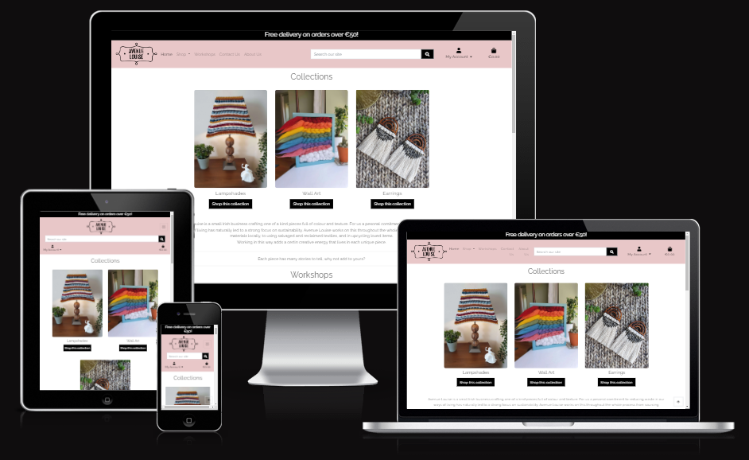

The Avenue Louise website is based on the Code Institute Boutique Ado walkthrough example application.

## Index – Table of Contents
* [User Experience (UX)](#user-experience-ux) 
* [Features](#features)
* [Design](#design)
* [Planning](#planning)
* [Technologies Used](#technologies-used)
* [Testing](#testing)
* [Deployment](#deployment)
* [Credits](#credits)

## User Experience (UX)

### User stories :

-   #### Store Owner Goals

1. As a **store owner**, I want **an e-commerce website** to **enable me to sell my products online**
2. As a **store owner**, I want **a website** to **advertise the workshops that I offer**
3. As a **store owner**, I want to **optimise the website SEO and search engine rankings** so **that potential customers can find the website easily**
4. As a **store owner**, I want to **easily be able to add products, workshops and testimonials** so **that i can keep my website up to date**
5. As a **store owner**, I want **a contact form** so **that site users or customers can easily contact me**

-   #### Developer Goals

1. As a **developer**, I want to **be able to setup Django and install required libraries** to **enable me to develop the site effectively and efficiently**
2. As a **developer**, I want to **setup a base template** to **enable me to maintain structure and styling across all pages of the website**
3. As a **developer**, I can **create and implement database models** so that **the Site Admin can upload images and details of products, workshops and testimonials**
4. As a **developer**, I want to **setup Authentication** to **enable me to create a superuser and users to set up an account**

-   #### Visitor Goals

1. As a **user** I can **clearly see how to navigate the website from the nav bar** so that **I can easily find what I am looking for**
2. As a **user** I can **see a footer at the bottom of the page** so that **I can find links to social sites and the email sign up form**
3. As an **unregistered user**, I want to be able to easily register on the website in order to save my details and keep track of previous orders
4. As a **user**, I want to **be able to browse through the products** to **find items that I might want to buy**
5. As a **user** I can **view details for a specific product** so that **I can learn more about it**
6. As a **registered user**, I want to **be able to view my profile** so that I can **update my details and view past orders**
7. As a **user** I can **easily reset my password in case I forget** so that **I can recover access to my account**
8. As a **user** I can **easily view the total of my purchases at any time** so that **I know how much money I am spending**
9. As a **user** I can **add items to my shopping cart** so that **I can checkout and purchase**
10. As a **user** I can **remove items from the shopping cart** so that **I can ensure I purchase the correct items**
11. As a **user** I can **complete my order on the checkout page** so that **I can verify the total is correct, enter my details and make payment**
12. As a **user** I can **view an order confirmation after checkout** so that **I can see what was ordered and total costs**
13. As a **user** I can **receive an email confirmation after checking out** so that **I have a record of my purchases**
14. As a **user**, I want to **be able to browse through the workshops** to **find workshops that I am interested in**
15. As a **user** I can **view details for a specific workshop** so that **I can learn more about it**
16. As a **user** I can **fill in a form** so that **I can contact the company to enquire about signing up for a workshop**
17. As a **user** I can **see testimonials** so that **I can feel confident about the quality of service provided by the company**
18. As a **user** I can **go to the About Us page** so that **find out more information about the company**
19. As a **user** I can **go to the Contact Us page** to **fill in a form to contact the company**

## Features

### Existing Features

-   ### F01 LOGO

    - The company logo is positioned left on the header
    - A user can click on the logo to bring them to the homepage
    - The logo was created on freelogodesign.org website. 

 -  ### F02 NAV BAR

    - The navigation menu links include a search box, a user icon to access user profile and a link to the shopping cart
    - The search box enables users to search for specific products by keyword from description or title.

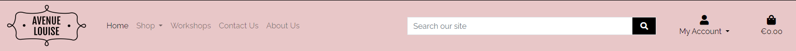

-   ### F03 SHOP DROPDOWN MENU

    - The Shop dropdown menu provides links to product categories for ease of navigation

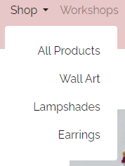

-   ### F04 MY ACCOUNT DROPDOWN MENU

    - The My Account dropdown menu will display Sign In and Register links if user is not signed in
    - If user is signed in they will see My Profile and Logout links
    - If the admin is logged in they will see links to Product Management, Workshop Management, Testimonial Management, My Profile and Logout links

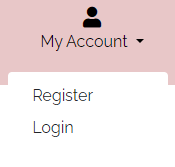
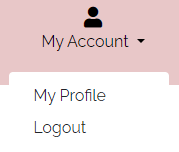
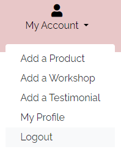

-   ### F05 HOMEPAGE

    - Homepage displays 3 categories(Collections) cards with links to products of that specified category
    - Welcome message
    - 3 workshop cards with links to view all workshops
    - Testimonials carousel

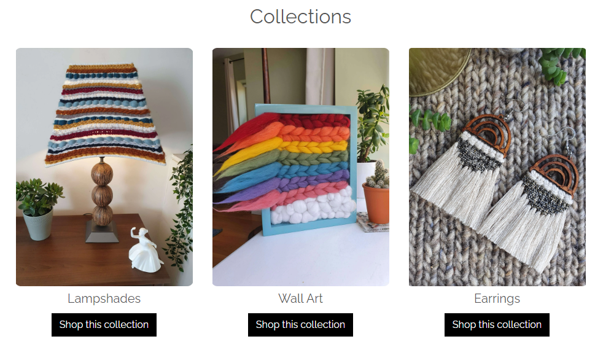
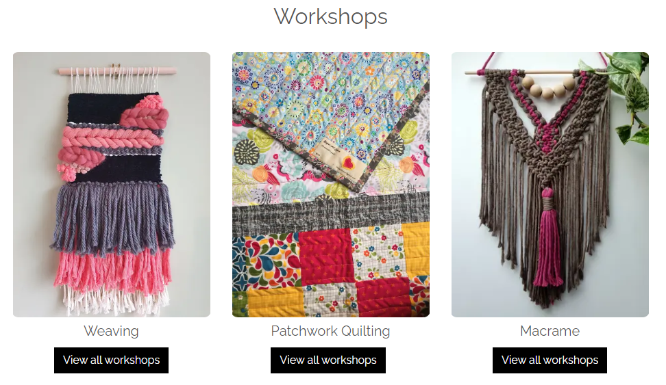
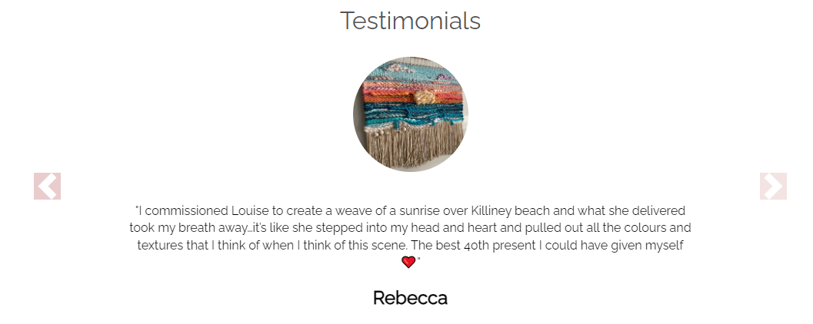

-   ### F06 FOOTER

    - Links to 3 social networks to enable users to connect with us through our social channels
    - Form to sign up to email subscription which is managed through MailChimp
    - Link to Privacy Policy 

-   ### F07 PRODUCTS PAGE

    - Full listing of all products on separate cards. 
    - Each card displays an image of the product, product title, category and price
    - Number of products displayed is shown
    - Edit and Delete links will be visible to the admin user

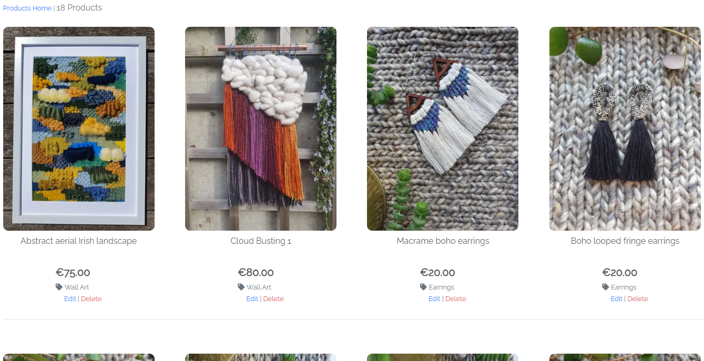

-   ### F08 PRODUCT DETAILS PAGE

    - User can see large image of the product, detailed description, size and price. 
    - They can choose to Add to basket or continue shopping
    - Edit and Delete links will be visible to the admin user

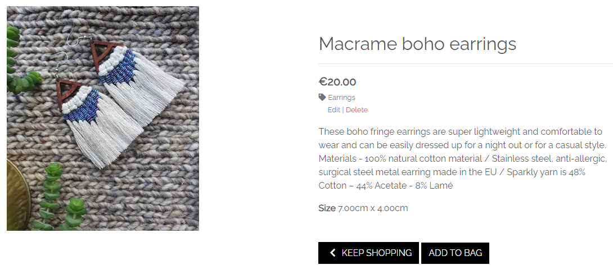

-   ### F09 SHOPPING BAG

    - User can see products that they have added to the bag and the total
    - A 'Continue to Checkout' button will be displayed

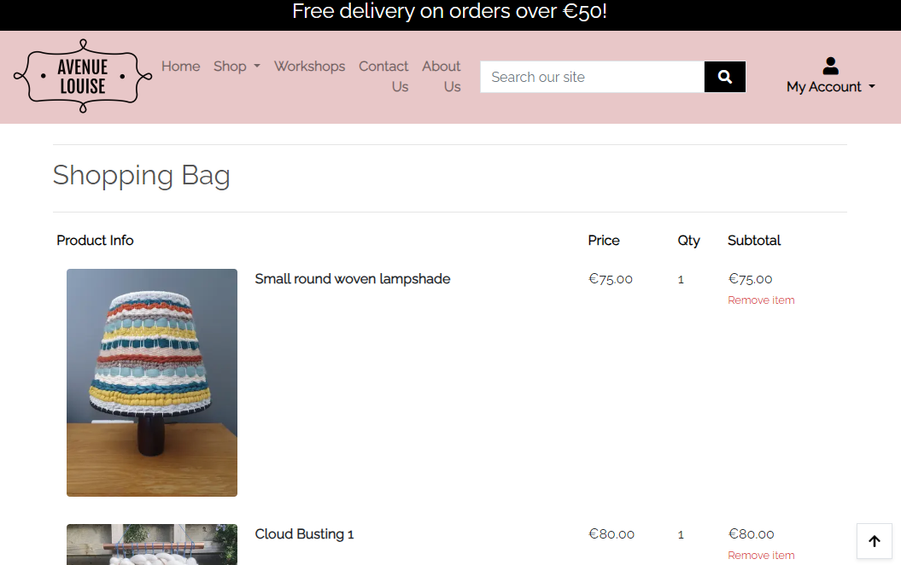

-   ### F10 CHECKOUT

    - User enter their delivery details and payment information to buy products
    - User will see 'Complete Order' button to make final payment
    - User will be directed to a success page following successful payment

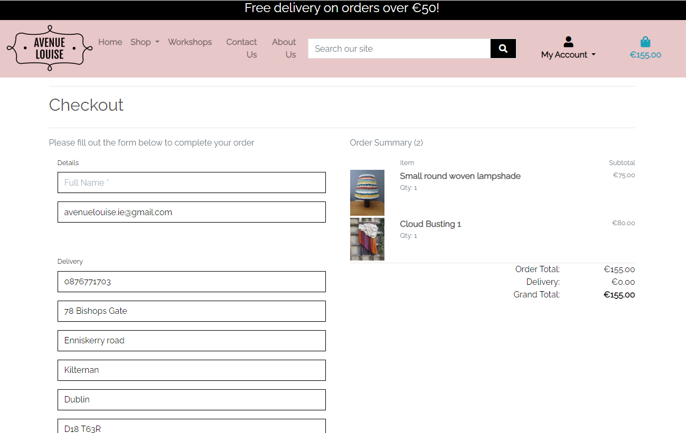
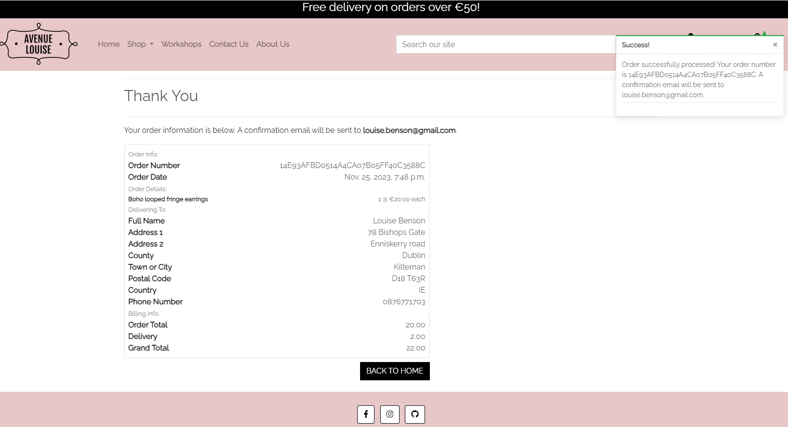

-   ### F11 CONFIRMATION EMAIL

    - User will receive a confirmation email following successful purchase

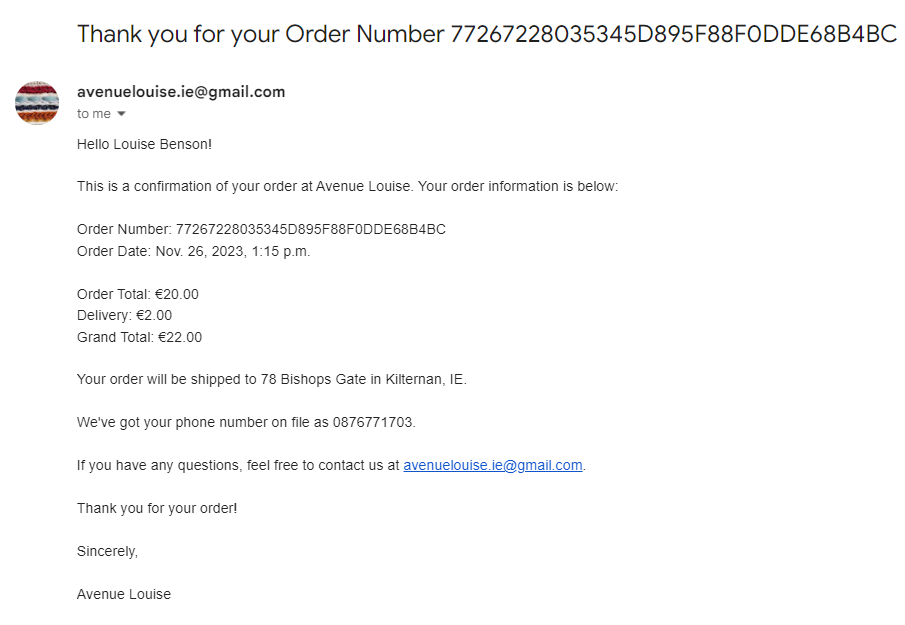

-   ### F12 MY PROFILE

    - When a user is logged in they will see My Profile within the My Account dropdown menu
    - The user can save or update their delivery information and see a summary of previous orders

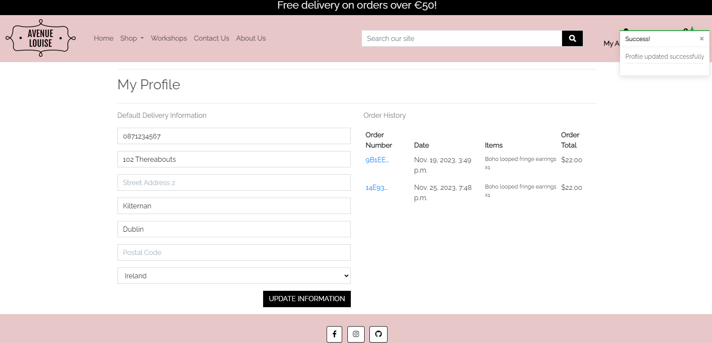

-   ### F13 WORKSHOPS

    - The workshops page displays a full listing of all workshops on separate cards. 
    - Each card displays a reference image for the workshop, snippet of description and a link to see more details

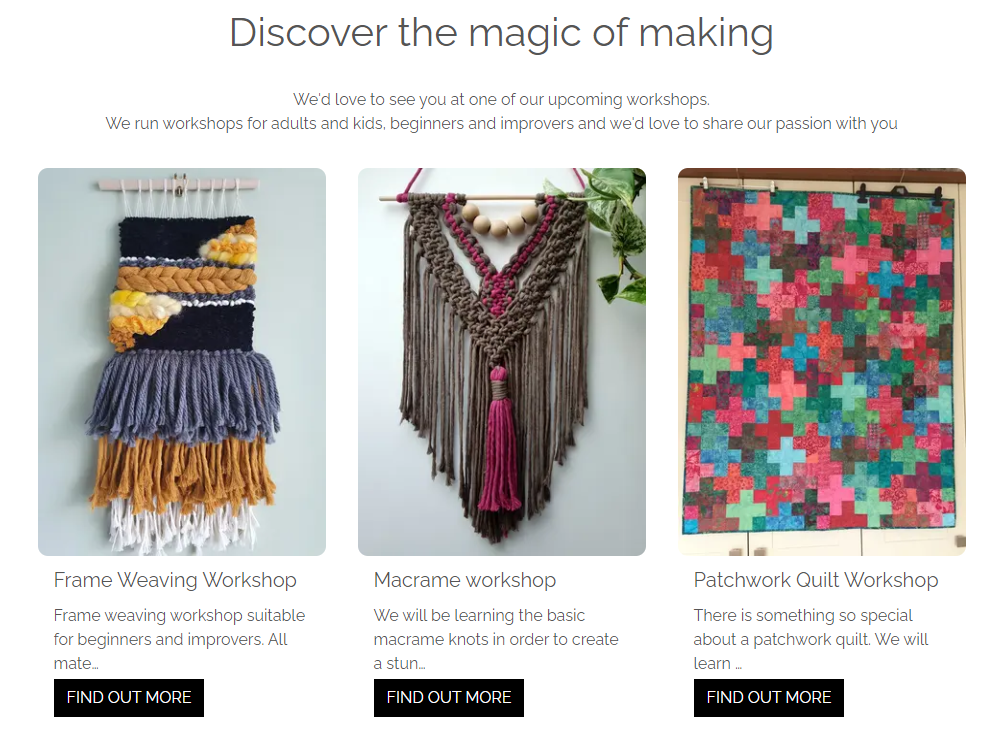

-   ### F14 WORKSHOP DETAILS PAGE

    - User can see image for the workshop, detailed description, location, date, price and number of places available. 
    - They can choose to 'Contact Us to Book In' or keep shopping. The 'Contact Us to Book In' button will bring the user to a form to contact the company.
    - Edit and Delete links will be visible to the admin user

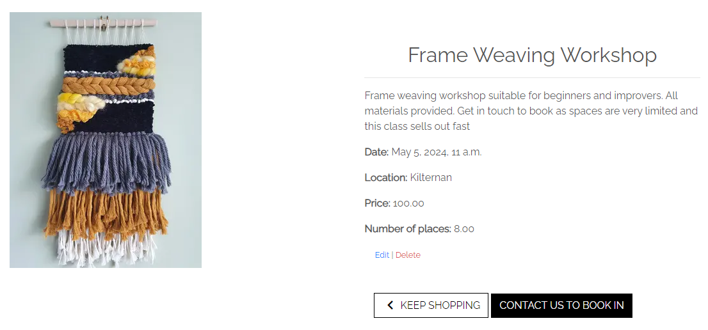

-   ### F15 ABOUT US PAGE

    - This page is for information about the company and gives customers confidence to purchase from the e-store.

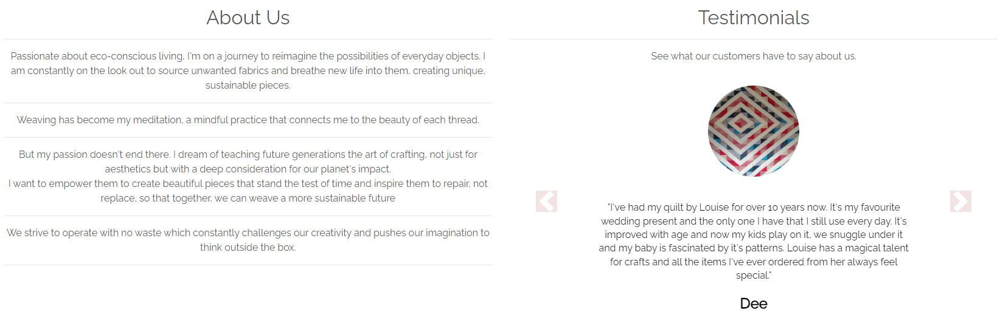 

-   ### F16 CONTACT US PAGE

    - This page provides the user with a form they can complete to contact the company

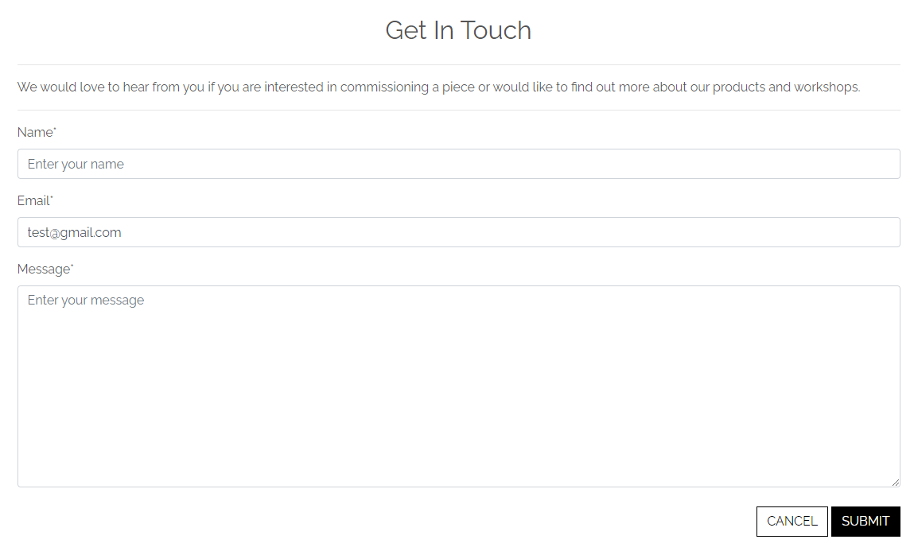 

-   ### F17 TESTIMONIALS

    - The Admin can add testimonials through a form on the application which auto populate in a carousel
    - Testimonials are displayed on the home page and about us page

-   ### F18 EDIT FUNCTION - WORKSHOPS AND PRODUCTS

    - The admin user can update/amend products and workshops
    - Alert message will be displayed to notify admin which product or workshop they are editing
    - Success messages will be displayed when product or whorkshop has successfully been updated

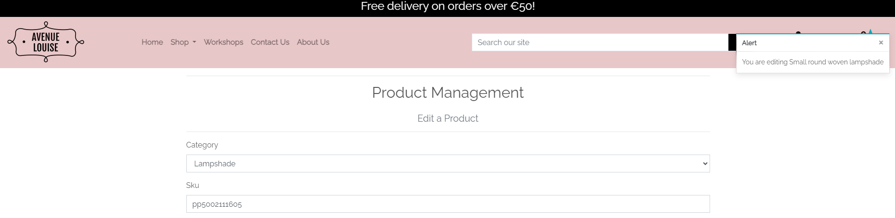

-   ### F19 DELETE FUNCTION - WORKSHOPS AND PRODUCTS

    - The admin user can delete products or workshops
    - The admin user must confirm that they want to go ahead with deletion
    - Success messages will be displayed when product or workshop has been deleted 

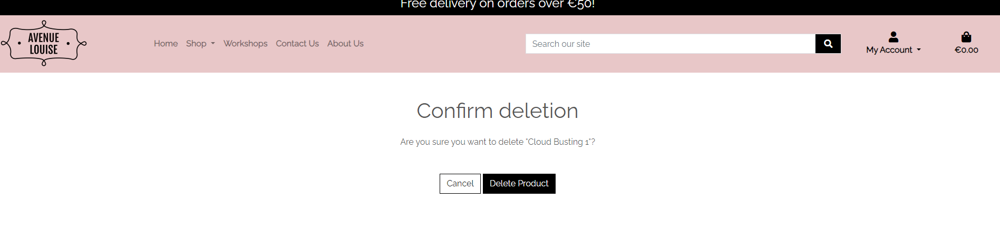

-   ### F20 ACCOUNT MANAGEMENT

    - The admin user can add Products, Workshops and Testimonials when they are logged in
    - Success messages will be displayed when product, workshop or testimonial has been added 

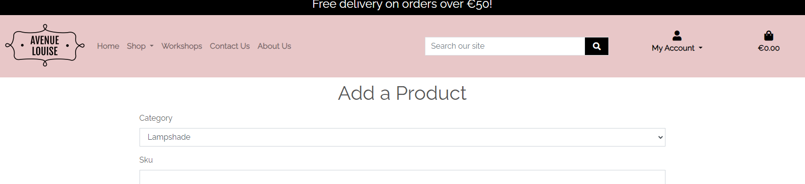

-   ### F21 AllAuth pages

    - In order for a user to be able to save their details they will need to register on the site and be signed in.
    - The sign in, sign up and logout allauth pages have been styled using crispy forms
    - If the user registers or logs in, they will get a success message to confirm.
    - When the user logs out, they will need to confirm that action and then they get a success message to confirm.

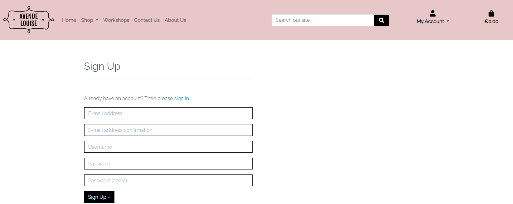

-   ### F22 NEWSLETTER

    - As part of the web marketing strategy, the site utilises the email subscription services managed by MailChimp.
    - The newsletter sign up form is located in the footer

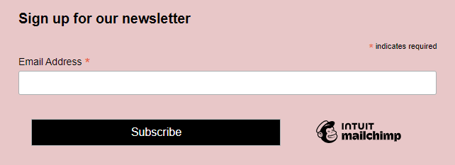

-   ### F22 PRIVACY POLICY

    - In line with GDPR requirements, there is a link to the Privacy Policy located at the bottom of the footer and opens in a new tab. The privacy policy was generated using https://www.privacypolicygenerator.info/

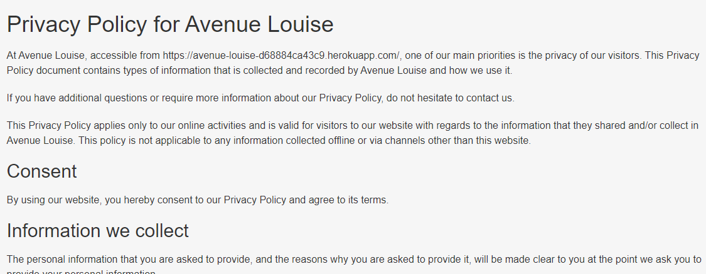

-   ### F23 404 PAGE

    - The user is directed to a custom 404 page if they try to access a page that doesn't exist

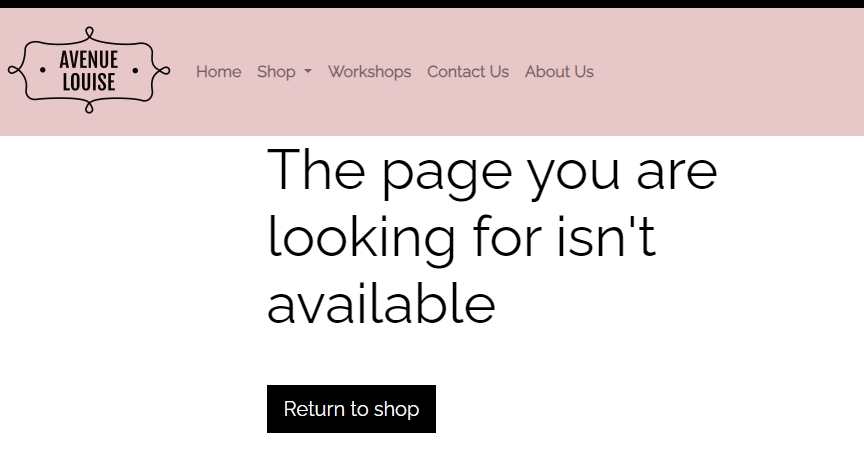

## Future Features

-   ### Commissions

    - A commissions page would include a form where users can fill in details of artwork that they would like to commission

-   ### Blog

    - A blog would help build the company brand and help with generating organic traffic through search engines

-   ### Multiple Images

    - It would be beneficial to have pictures from different angles.

## Design

-   ### Colours
    - As the product and workshop images are very colourful, it was decided to keep the colour scheme minimal to keep the site looking clean and easy to navigate.
    - The navbar and footer have a pale creamy pink background colour (#e8c7c8) which is also used on the testimonial slider buttons

-   ### Wireframes
    - During project planning, a rough layout of the site was designed knowing that this would be altered in later stages of the development as functionality was prioritised at the start, with aesthetics planned for the second stage of development.

    

    
Original Wireframe Design

    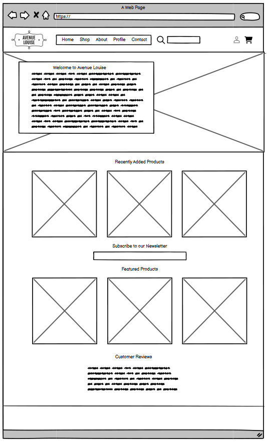
    

  
      

    
Updated Homepage Wireframes

    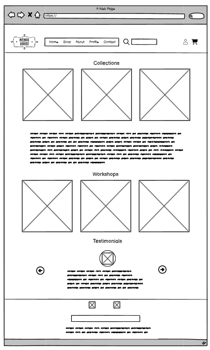
    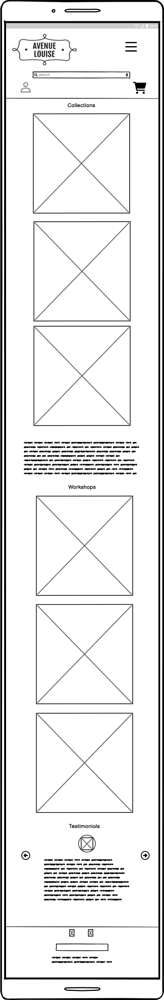
    

    

    
Products and Workshops Wireframes

    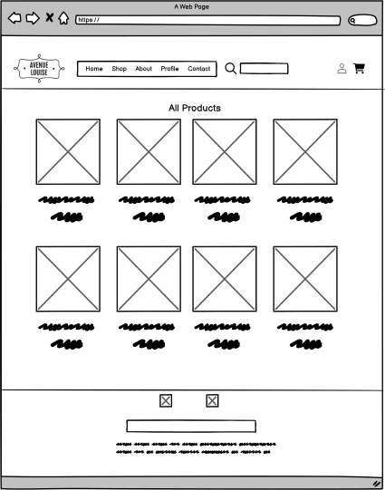
    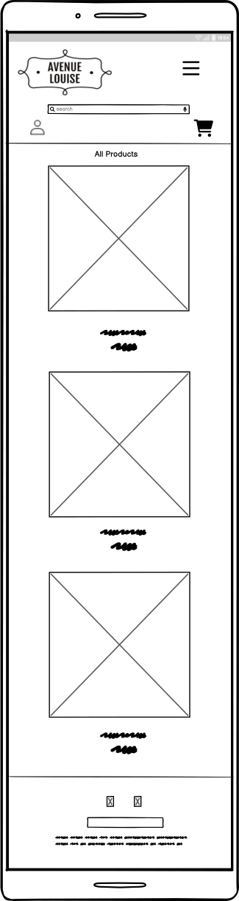
    

    

    
Products and Workshops Details Wireframes

    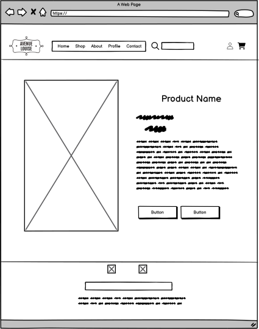
    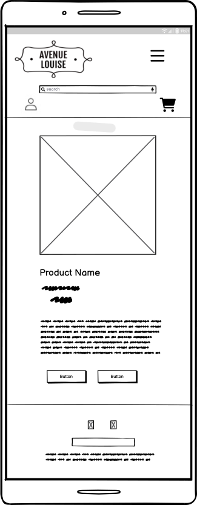
    

-   ### Entity-Relationship diagram for DBMS

    - The below diagram visually represents how the database models are connected.
    - The User data is captured during user registration and is handled by django.
    - The Product model is adapted from the Boutique ado application by adding height, width and in stock 
    - The Order, OrderLineItem, UserProfile and Category tables are the same as Boutique Ado and have not been customised
    - The Workshop, WorkshopContact, ContactUs and Testimonials models have been created from scratch in line with data requirements

    

    
Database Schema

    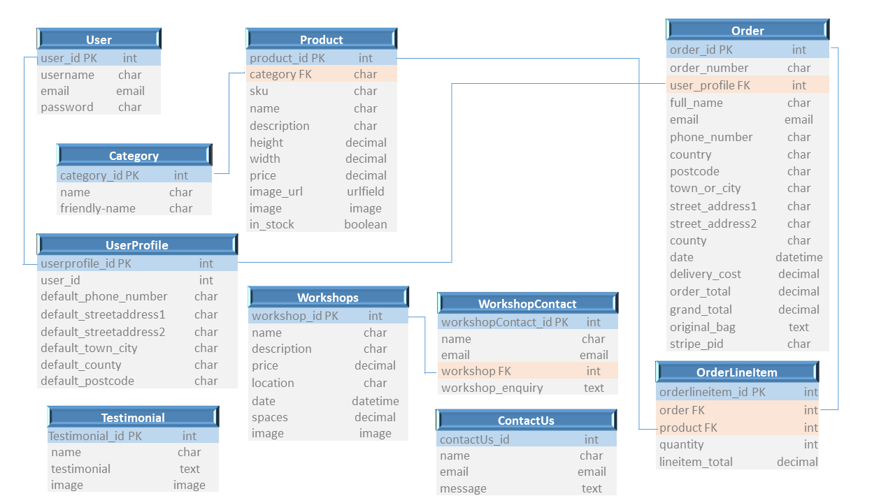
    

## Planning

- The ideal user is:

  - anyone who is interested in buying textile art or taking part in one of our workshops
 
- Site goals:

  - To provide users with a platform to buy textile art
  - To provide users with a platform to contact the company about workshops

- Stock:
  - The products for sale on the website are unique pieces so there is only one of each item available. 
  - If a user tries to add an item that is already in their bag, they will see a message pop up to tell them it is already in the bag.
  - When an item has been purchased it will still be displayed but users will not be able to add it to their bag.

    ### Agile Kanban board

    - Link to Github Project board that **User Storires** were added and managed from [Avenue Louise Agile Tool](https://github.com/users/Louibens/projects/5)
    - There are **3 MILESTONES** - MVP (functionality), LAYOUT (visual design), TESTING. These were added to Columns on the Kanban board where completed user stories were moved to upon completion.
    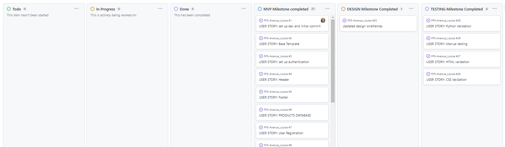
    - The **User Stories** are organised into **EPICS** and they have acceptance criteria, tasks and labels to show whether the requirement was Must Have, Could Have, Won't have.
    - **EPICS** are 
    1. Initial plan and dev set up
    2. Registration & Account Management
    3. Viewing and Navigation
    4. Purchasing and Checkout
    5. Admin and Store Management
    7. Workshops
    9. Testimonials
    10. Design and SEO
    11. Validation
    12. Manual Testing

## Technologies Used

### Languages Used 

-   [HTML5](https://en.wikipedia.org/wiki/HTML5)
-   [CSS3](https://en.wikipedia.org/wiki/Cascading_Style_Sheets)
-   [Python](https://www.python.org/)
-   [jQuery](https://jquery.com/)

### Frameworks, Libraries & Programs Used  

-   [Google Fonts:](https://fonts.google.com/) used for the Raleway font.
-   [Font Awesome:](https://fontawesome.com/) was used to add social network icons.
-   [Git:](https://git-scm.com/) was used for version control by utilising the Gitpod terminal to commit to Git and Push to GitHub.
-   [GitHub:](https://github.com/) is used as the respository for the project code after being pushed from Git. GitHub projects was use to set up a Kanban board to facilitate the Agile development standards.
-   [Balsamiq:](https://balsamiq.com/) was used to create the wireframes during the design process.
-   [Django](https://www.djangoproject.com/) was used as the framework 
-   [Bootstrap](https://getbootstrap.com/) was used to build responsive web pages
-   [Gunicorn](https://gunicorn.org/) was used as the Web Server to run Django on Heroku
-   [dj_database_url](https://pypi.org/project/dj-database-url/) library used to allow database urls to connect to the postgres db
-   [psycopg2](https://pypi.org/project/psycopg2/) database adapter used to support the connection to the postgres db
-   [AWS](https://aws.amazon.com/) used to store the images and static files used by the application
-   [Django allauth](https://django-allauth.readthedocs.io/en/latest/index.html) used for account registration and authentication
-   [Django crispy forms](https://django-crispy-forms.readthedocs.io/en/latest/) used to simplify form rendering
-   [Django Pillow](https://pypi.org/project/Pillow/) to enable image processing capabilities
-   [Stripe](https://stripe.com/) to enable secure payment processing capabilities
-   [ElephantSQL](https://www.elephantsql.com/) to host the applications Postgres database
-   [Heroku](https://www.heroku.com/) used to host the deployed back-end site

## Testing
Testing documentation can be found [here.](./TESTING.md)

## Deployment 

Detailed below are instructions on how to clone and fork this project repository and the steps to configure and deploy the application.  

1. How to Clone the Repository
2. How to Fork the Repository
3. Create Application and Postgres DB on Heroku
4. Configure AWS to host images and static files used by the application
5. Connect the Heroku app to the GitHub repository
6. Final Deployment steps

### 1. How to Clone the Repository 

- Go to the https://github.com/Louibens/PP5-Avenue_Louise repository on GitHub 
- Click the "Code" button to the right of the screen, click HTTPs and copy the link there
- Open a GitBash terminal and navigate to the directory where you want to locate the clone
- On the command line, type "git clone" then paste in the copied url and press the Enter key to begin the clone process
- To install the packages required by the application use the command : pip install -r requirements.txt
- When developing and running the application locally set DEBUG=True in the settings.py file
- Changes made to the local clone can be pushed back to the repository using the following commands :

  - git add *filenames*  (or "." to add all changed files)
  - git commit -m *"text message describing changes"*
  - git push

- N.B. Any changes pushed to the master branch will take effect on the live project once the application is re-deployed from Heroku

### 2. How to fork the repository

- Go to the https://github.com/Louibens/PP5-Avenue_Louise repository on GitHub 
- Click the "Fork" button in the top right corner

### 3. Create Application and Postgres DB on Heroku
- Log in to Heroku at https://heroku.com - create an account if needed.
- From the Heroku dashboard, click the Create new app button.  
- On the Create New App page, enter a unique name for the application and select region.  Then click Create app.
- On the Application Configuration page for the new app, click on Settings on the Application Configuration page and click on the "Reveal Config Vars" button - add the necessary variables.
- In Gitpod, in the project terminal window, to initialize the data model in the postgres database, run the command : python3 manage.py migrate 
- Make sure the project requirements.txt file is up to date with all necessary supporting files by entering the command : pip3 freeze --local > requirements.txt
- Commit and push any local changes to GitHub.
- In order to be able to run the application on localhost

### 4. Configure AWS S3 bucket to host images and static files used by the application
- Log in to AWS - create an account if needed.  
- Click on S3 from Services menu and create a new bucket and allow public access by unchecking "Block all public access"
- Turn on static website hosting within the properties section
- In the permissions section, configure CORS and Generate a policy
- Create a User through IAM
- Download and save the generated csv which contains the users access and secret access keys
- Update the settings.py file for 'USE_AWS' with the bucket name and region
- Add the AWS_ACCESS_KEY_ID and AWS_SECRET_ACCESS_KEY config vars to heroku using the values from the downloaded cvs
- Add USE_AWS = True to the Heroku config vars

### 5. Connect the Heroku app to the GitHub repository
- Go to the Application Configuration page for the application on Heroku and click on the Deploy tab.
- Select GitHub as the Deployment Method and if prompted, confirm that you want to connect to GitHub. Enter the name of the github repository (https://github.com/Louibens/PP5-Avenue_Louise) and click on Connect to link up the Heroku app to the GitHub repository code.
- Scroll down the page and choose to either Automatically Deploy each time changes are pushed to GitHub, or Manually deploy - for this project Manual Deploy was selected.
- The application can be run from the Application Configuration page by clicking on the Open App button.
- The live link for this project is (https://avenue-louise-d68884ca43c9.herokuapp.com/)

### 6. Final Deployment steps
Once code changes have been completed and tested on localhost, the application can be prepared for Heroku deployment as follows :
- Set DEBUG flag to False in settings.py
- Ensure requirements.txt is up to date using the command : pip3 freeze --local > requirements.txt
- Push files to GitHub
- In the Heroku Config Vars for the application delete this environment variable :  DISABLE_COLLECTSTATIC
- On the Heroku dashboard go to the Deploy tab for the application and click on deploy branch

#### The live link to the application can be found here - [Avenue Louise](https://avenue-louise-d68884ca43c9.herokuapp.com/) 

## Credits 

### Code 

- The testimonials carousel code and css are adapted from https://codepen.io/baahubali92/pen/BvdmLo
- Following inital deployment, I had an issue where the css file was not updating in the dev environment. Tutor support advised to stop the dev environment, run collect_static and then do a hard refresh. This solution was not ideal as I like to add to css and then quickly view how the change looks. I found an alternate solution by commenting out     STATICFILES_STORAGE = 'custom_storages.StaticStorage' and     STATIC_URL = f'https://{AWS_S3_CUSTOM_DOMAIN}/{STATICFILES_LOCATION}/' and updating USE_AWS in env.py to False

### Media 

All images are my own and have been compressed using tinypng.com and converted to webp using convertio.co

### Acknowledgments

- Thanks goes to my family who have given me the time and space to learn a lot during the building of this project and over the last 12 months. I am proud of what I have achieved thanks to their patience and understanding.
- I had a new mentor for my last project, Dick Vlaanderen. He pushed me on the models side of the application which helped me to produce a better project.
- I used Tutor Support a few times during this project and would like to thank them for their patience and support along with my cohort facilitator, Laura.
- Thanks to the Code Institute for supporting me through this journey which I could not have even imagined this time 12 months ago.