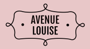
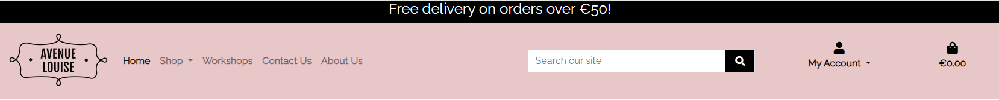

<h1 align="center">Avenue Louise - Textile Arts</h1>

[View the live project here](https://avenue-louise-d68884ca43c9.herokuapp.com/)

Avenue Louise is a B2C e-commerce application which sells textile arts and offers workshops. Users can view, search and filter the products on offer, add products to their shopping cart and purchase through a secure single payment.
Users can view the workshops on offer and complete a form to make further enquiries.

The Web Marketing strategies used by the project are :
- Organic Social - through Facebook and Instagram
- Email - through a newletter subscription managed via Mailchimp

The Avenue Louise website is based on the Code Institute Boutique Ado walkthrough example application.

## Index – Table of Contents
* [User Experience (UX)](#user-experience-ux) 
* [Features](#features)
* [Design](#design)
* [Planning](#planning)
* [Technologies Used](#technologies-used)
* [Testing](#testing)
* [Deployment](#deployment)
* [Credits](#credits)

## User Experience (UX)

### User stories :

-   #### Developer Goals

1. As a **developer**, I want to **be able to setup Django and install required libraries** to **enable me to develop the site effectively and efficiently**
2. As a **developer**, I want to **setup a base template** to **enable me to maintain structure and styling across all pages of the website**
3. As a **developer**, I can **create and implement a database model** so that **the Site Admin can upload images and details of products**
4. As a **developer**, I want to **setup Authentication** to **enable me to create a superuser and users to set up an account**

-   #### Visitor Goals

1. As a **user** I can **clearly see how to navigate the website from the nav bar** so that **I can easily find what I am looking for**
2. As a **user** I can **see a footer at the bottom of the page** so that **I can find links to social sites and the email sign up form**
3. As an **unregistered user**, I want to be able to easily register on the website in order to save my details and keep track of previous orders
4. As a **user**, I want to **be able to browse through the products** to **find items that I might want to buy**
5. As a **user** I can **view details for a specific product** so that **I can learn more about it**
6. As a **registered user**, I want to **be able to view my profile** so that I can **update my details and view past orders**
7. As a **user** I can **easily reset my password in case I forget** so that **I can recover access to my account**
8. As a **user** I can **easily view the total of my purchases at any time** so that **I know how much money I am spending**
9. As a **user** I can **add items to my shopping cart** so that **I can checkout and purchase**
10. As a **user** I can **modify cart quantities and remove items from the shopping cart** so that **I can ensure I purchase the correct items and quantities**
11. As a **user** I can **complete my order on the checkout page** so that **I can verify the total is correct, enter my details and make payment**
12. As a **user** I can **view an order confirmation after checkout** so that **I can see what was ordered and total costs**
13. As a **user** I can **receive an email confirmation after checking out** so that **I have a record of my purchases**
14. As a **user**, I want to **be able to browse through the workshops** to **find workshops that I am interested in**
15. As a **user** I can **view details for a specific workshop** so that **I can learn more about it**
16. As a **user** I can **fill in a form** so that **I can contact the company to enquire about signing up for a workshop**
17. As a **user** I can **see testimonials** so that **I can feel confident about the quality of service provided by the company**
18. As a **user** I can **go to the About Us page** so that **find out more information about the company**
19. As a **user** I can **go to the Contact Us page** to **fill in a form to contact the company**

## Features

### Existing Features

-   ### F01 LOGO

    - The company logo is positioned left on the header
    - A user can click on the logo to bring them to the homepage
    - The logo was created on freelogodesign.org website. 

 -  ### F02 NAV BAR

    - The navigation menu links include a search box, a user icon to access user profile and a link to the shopping cart
    - The nav bar will also display a link to the Admin panel if the admin user is logged in.
    - The search box enables users to search for specific items by keyword from description or title.

-   ### F03 SHOP DROPDOWN MENU

    - The Shop dropdown menu provides links to product categories for ease of navigation

-   ### F03 MY ACCOUNT DROPDOWN MENU

    - The My Account dropdown menu will display Sign In and Register links if user is not signed in
    - If user is signed in they will see My Profile and Logout links
    - If the admin is logged in they will see links to Product Management, Workshop Management, Testimonial Management, My Profile and Logout links

-   ### F05 HOMEPAGE

    - Homepage displays 3 categories(Collections) cards with links to products of that specified category
    - Welcome message
    - 3 workshop cards with links to view all workshops
    - Testimonials carousel

-   ### F06 FOOTER

    - Links to 2 social networks to enable users to connect with us through our social channels
    - Form to sign up to email subscription which is managed through MailChimp
    - Link to Privacy Policy 

-   ### F07 PRODUCTS PAGE

    - Full listing of all products on separate cards. 
    - Each card displays an image of the product title, category and price
    - Number of products displayed is shown
    - Edit and Delete links will be visible to the admin user

-   ### F08 PRODUCT DETAILS PAGE

    - User can see large image of the product, detailed description, size and price. 
    - They can choose to Add to basket or continue shopping
    - Edit and Delete links will be visible to the admin user

-   ### F09 WORKSHOPS

    - The workshops page displays a full listing of all workshops on separate cards. 
    - Each card displays a reference image for the workshop, snippet of description and a link to see more details

-   ### F08 WORKSHOP DETAILS PAGE

    - User can see image for the workshop, detailed description, location, date, price and number of places available. 
    - They can choose to 'Contact Us to Book In' or keep shopping. The 'Contact Us to Book In' button will bring the user to a form to contact the company.
    - Edit and Delete links will be visible to the admin user

-   ### F12 ABOUT US PAGE

    - This page is for information about the company and gives customers confidence to purchase from the e-store.

 

-   ### F12 CONTACT US PAGE

    - This page provides the user with a form they can complete to contact the company

 

-   ### F13 EDIT FUNCTION - WORKSHOPS AND PRODUCTS

    - The admin user can update/amend products and workshops
    - Alert message will be displayed to notify admin which product or workshop they are editing
    - Success messages will be displayed when product or whorkshop has successfully been updated

-   ### F14 DELETE FUNCTION - WORKSHOPS AND PRODUCTS

    - The admin user can delete products or workshops
    - The admin user must confirm that they want to go ahead with deletion
    - Success messages will be displayed when product or workshop has been deleted 

-   ### F14 ACCOUNT MANAGEMENT

    - The admin user can add Products, Workshops and Testimonials when they are logged in
    - Success messages will be displayed when product, workshop or testimonial has been added 

-   ### F15 AllAuth pages

    - In order for a user to be able to save their details they will need to register on the site and be signed in.
    - The sign in, sign up and logout allauth pages have been styled using crispy forms
    - If the user registers or logs in, they will get a success message to confirm.
    - When the user logs out, they will need to confirm that action and then they get a success message to confirm.

## Future Features

-   ### Commissions

    - A commissions page would include a form where users can fill in details of artwork that they would like to commission

## Design

-   ### Wireframes
    - During project planning, a rough layout of the site was designed knowing that this would be altered in later stages of the development as functionality was prioritised at the start with aesthetics planned for the second stage of development.

    

    
Original Wireframe Design

    
    

  
      

    
Final Desktop Wireframes

    
    

-   ### Entity-Relationship diagram for DBMS

    - The below diagram visually represents how the database models are connected ...

    

    
Database Schema

    
    

## Planning

## Technologies Used

### Languages Used 

-   [HTML5](https://en.wikipedia.org/wiki/HTML5)
-   [CSS3](https://en.wikipedia.org/wiki/Cascading_Style_Sheets)
-   [Python](https://www.python.org/)

### Frameworks, Libraries & Programs Used  

## Testing

### Validator Testing 

### Manual Testing Test Cases and Results 

### Known bugs

## Deployment 

## Credits 

### Code 

### Content 

### Media 

### Acknowledgments
