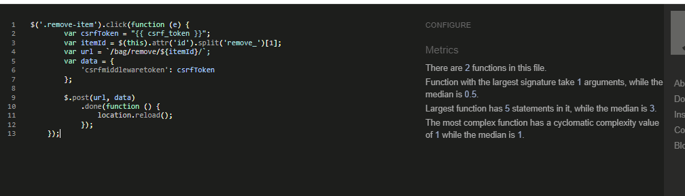
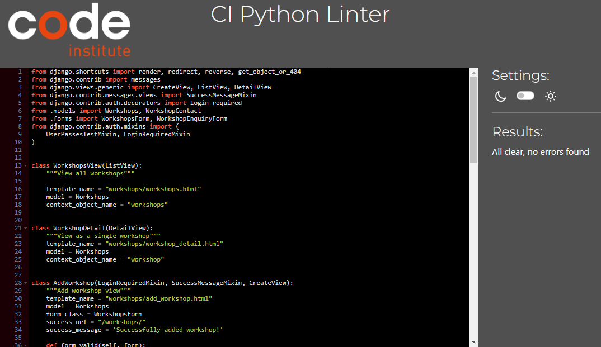

Go back to [README.md](/README.md)

# Testing
- [Code Validation](#code-validation)
    - [HTML](#html)
    - [CSS](#css)
    - [JavaScript](#JavaScript)
    - [Python](#python)
- [Responsiveness](#Responsiveness)
- [Lighthouse](#Lighthouse)
- [Manual Testing](#manual-testing)

## Code Validation
### HTML

W3C Validator flagged 
- “The type attribute is unnecessary for JavaScript resources.”. Updated where necessary
- "The value of the for attribute of the label element must be the ID of a non-hidden form control." Updated the checkout page

    
Homepage

    
Products

    
Product Details

    
Workshops

    
Workshop Details

    
About Us

    
Contact Us

    
My Profile

    
Add a Product

    
Add a Workshop

    
Add a Testimonial

    
Bag

    
Checkout

    
Checkout Success

### CSS

Jigsaw CSS validator - no issues flagged

    
base.css

    
checkout.css

### JavaScript

JSHint flagged one undefined variable which cannot be changed as it is required for Stripe. Any missing semi-colons have been added where required.

    
stripe_elements.js

    
scroll to top

    
remove item

### Python

Issues flagged during python code validation were mainly lines too long or blank spaces. All of the flagged issues have been resolved.

- avenue_louise project app

    
settings.py

    
urls.py

    
views.py

&nbsp;

- bag app

    
bag_contexts.py

    
urls.py

    
views.py

&nbsp;

- checkout app

    
admin.py

    
forms.py

    
models.py

    
signals.py

    
urls.py

    
views.py

    
webhook_handler.py

    
webhooks.py

&nbsp;

- home app

    
admin.py

    
forms.py

    
models.py

    
urls.py

    
views.py

&nbsp;

- products app

    
admin.py

    
forms.py

    
models.py

    
urls.py

    
views.py

    
widgets.py

&nbsp;

- profiles app

    
forms.py

    
models.py

    
urls.py

    
views.py

&nbsp;

- testimonials app

    
admin.py

    
forms.py

    
models.py

    
urls.py

    
views.py

&nbsp;

- workshops app

    
admin.py

    
forms.py

    
models.py

    
urls.py

    
views.py

## Responsiveness

The site has been fully tested on different screen sizes to ensure users get an optimal experience whether accessing the site from a mobile or on a desktop computer. Bootstrap grid system is used to reposition elements depending on screensize. 

